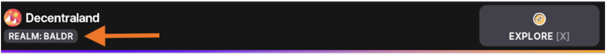
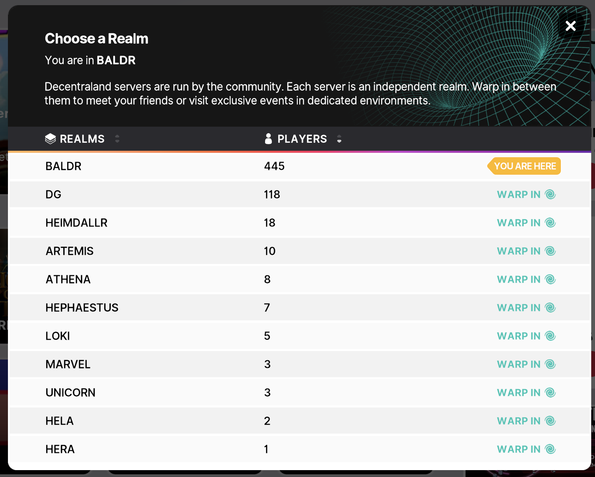
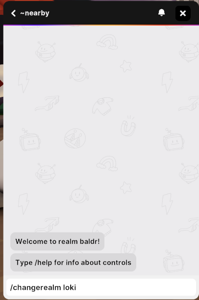
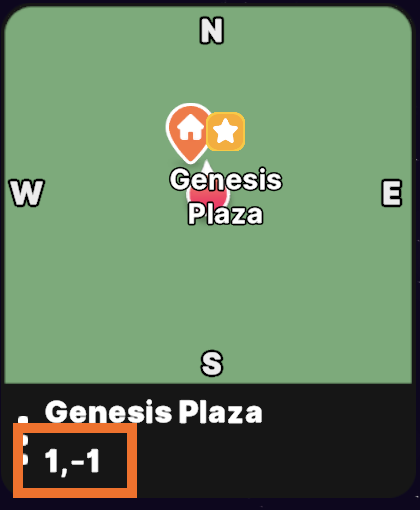

Being a decentralized platform involves having different servers hosted by different community members and to be able to meet with your friends or colleagues in-world, you all need to be in the same place. This can represent a challenge until you understand what being in the same place means. 

There are two aspects to take into consideration when we talk about a place in Decentraland, the first one is the Realm or Server and the second one is the Position. 

The platform currently has 11 servers that have friendly names such as Hela, Baldr or Loki and each server represents a realm. When you are logged into the platform, you are only be able to interact with users connected to the same realm that you are in. Finding or changing the realm is an easy process and there are several ways to do it. Once you are in-world you can click on your profile at the top right corner of the screen, this will open a window with different things that you can change or explore but what we are looking for is at the top left corner of the window, there you will see the realm name you are in: 

If you click on the realm name, a new pop up window will be opened showing the complete list of available realms and the quantity of users in each of them and, by clicking on the **WARP IN** link you can easily jump between realms. 

Another way to jump to a different realm is to use one of the available chatbox commands, the commands are a common handy toold that every platform user should learn about. To change realm using a command you need to open the chat as if you were about to send a message to the nearby players and write the following message that starts with a forward slash `/changerealm [realm-name]`, replacing `[realm-name]` for the actual `name` of the realm that you want to go (there are different handy commands that you can explore using the `/help` command on the chatbox), for example `/changerealm loki` will take you to the Loki realm:  

Now that you are in the realm where you want to meet your mates, the second aspect to be at the same place is the **position** or location coordinates which are determined by two numbers representing the **x** and **y** axis of the Genesis City map. When you enter Genesis City you land at the `0,0` coordinates that are at the center of the world and this is where the Genesis Plaza is located, usually a crowded place as it is where most users land. The range of possible coordinates goes from `-150` to `150` for both axes and as a result, you get 90 thousand possibilities to choose from.     

Now the questions are: How to pick a location? And how to get there? 

On the Map at the top left coroner of the screen, there is a section where you have your current location coordinates and the Map view it’s also a portal to the rest of Genesis City. Open the full map by click on it and jump in any Genesis City location just by selecting the point on the map, you can go crazy and pick a random spot or, you can also open the Places page that has the city points of interest list and pick a cool location from there. To see the existing points of interest, click on your profile picture again, then select the `Explore` section and open the Places tab. 

There is another chabtox command that you can use to go to different locations on the Genesis City, on the chat and write `/goto [x,y]` and replace `[x,y]` with the two coordinates that you want to go, for example writing `/goto 100,-50` will take you to that location. 

At this point you should be at the meeting place, realm & location, so it's time to share this with your friends, send them a message *"let's meet in Loki at 100,-33"* or you they can also search for you on their friends list and click on the red arrow button that will take them exactly where you are. Finally, if you are using the web browser client, there is another less convenient possibility, to share your current URL as it will contains your current locations details and take there anyone who opens it. 

**The TL;DR version**: 
To meet with someone you need to be at the same realm and position. Use the Map view to move around or the realm selection window to change where you are. You can also use the `/changrealm [realm-name]` and `/goto [x,y]` commands te get to where you want. 
